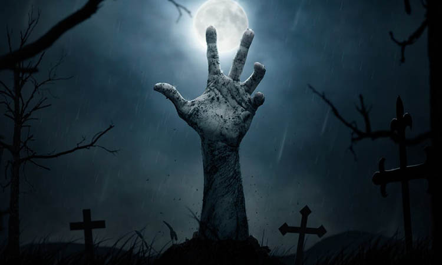
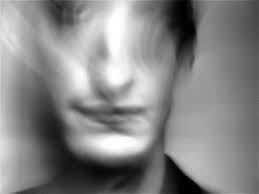
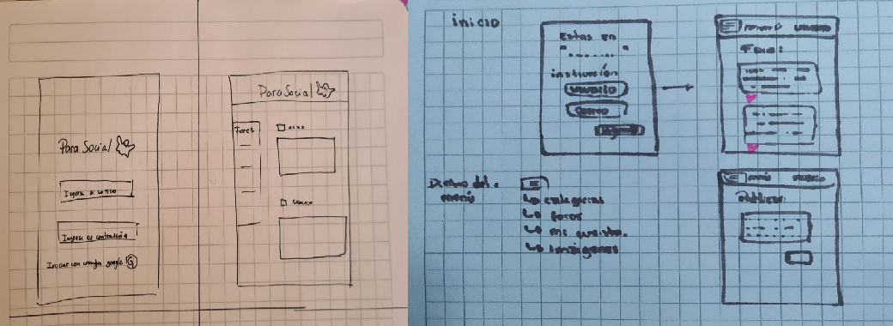

# Creando una red social: Parasocial 👻
## Indice

* [1. Introducción al proyecto](#1-introducción-al-proyecto)
* [2. A qué usuario se dirige ParaSocial](#2-a-qué-usuario-se-dirige-el-juego)
* [3. Prototipo del proyecto](#6-prototípo-del-proyecto)
* [4. Instrucciones de uso](#3-instrucciones-de-uso)
* [5. Dónde encontrar la página](#4-dónde-encontrar-la-página)
* [6. Herramientas que se utilizaron para realizar el proyecto](#5-herramientas-que-se-utilizaron-para-realizar-el-proyecto)

***

## 1. Introducción al proyecto

**ParaSocial** es una red social enfocada en el mundo de lo paranormal e información relacionada a este. En este proyecto, encontrarás un pantalla principal donde podrás registrarte y logearte para comenzar a publicar los temas que puedan ser interesantes para ti, desde información de fantasmas, duendes o brujas hasta publicar informes verídicos que demuestren la existencia de estos. Es muy importante que sigas bien las **reglas** del foro, donde respetarás a cada usuario, no revelarás información personal y sobre todo, no está permitido el **crybecrimen o cyberacoso** en esta red social. En casos donde no se respeten las reglas de convivencia, serán baneados **permanentemente** del foro. 

## 2. A qué usuario se dirige ParaSocial 

El usuario al cuál va dirigido nuestro proyecto, comprende dentro del rango de 20 a 50 años, donde el mayor interés es que se cree una red social que hable de temas misteriosos y **paranormales** con información basada en hechos reales, así demostrando informes, investigaciones, documentales o evidencia que avale la publicación. Es importante que, como usuario sepas que toda la información que se publica en el foro será cuidadosamente leída por el staff y analizada para que cumpla con las *normas y politicas* de la página. 

## 3. Prototipo del proyecto

En primer lugar, este proyecto fue diseñado en un prototipo de baja fidelidad por las integrantes del equipo de Parasocial, juntando las ideas y creando una encuesta para saber las caracteristicas y necesidades mínimas que debia cumplir el usuario. 

 

En el siguiente link podrás encontrar el prototipo de alta fidelidad del proyecto en forma digital, el cual se basó en las necesidades del usuario al momento de realizar las encuestas y entrevistas pertinentes.

[Prototipo realizado en figma para el proyecto 3 de laboratoria](https://www.figma.com/proto/u7hemR3B5NpsdxxnNTv8Y4/PARASOCIAL?node-id=28%3A0&scaling=scale-down&page-id=0%3A1).

## 4. Instrucciones de uso

El entrar a la página, encontrarás una pantalla principal donde podrás registrarte o ingresar a la página web. Para registrarte debes hacer "click" en **Sign Up**, ingresar un correo valido y una contraseña de 6 caracteres, confirmarla y registrarte. Una vez registrado, podrás ingresar al foro en la pestaña **Login**, utilizando el correo y contraseña registrado o bien, ingresando con una cuenta de google. Una vez ingresado, podrás participar del foro ya sea publicando, editando y borrando tus propios comentarios. **Es necesario que respetes las normas y politicas de la página.**

## 5. Dónde encontrar la página

Podrás encontrar la página directamente desde estos enlaces:

* [Proyecto Carolina M](https://github.com/CarolinaMorales1992/SCL016-social-network).
* [Proyecto Daniela V](https://github.com/Danipaz1/SCL016-social-network).
* [Proyecto Sofia B](https://github.com/SofiBenavente/SCL016-social-network).

O bien, en el siguiente link directo: [ParaSocial](https://github.com/CarolinaMorales1992/SCL016-social-network).

## 6. Herramientas que se utilizaron para realizar el proyecto

* CSS
* Html
* JavaScript
* Node.js 
* GitBash
* PowerShell
* Bootstrap
* Firebase

